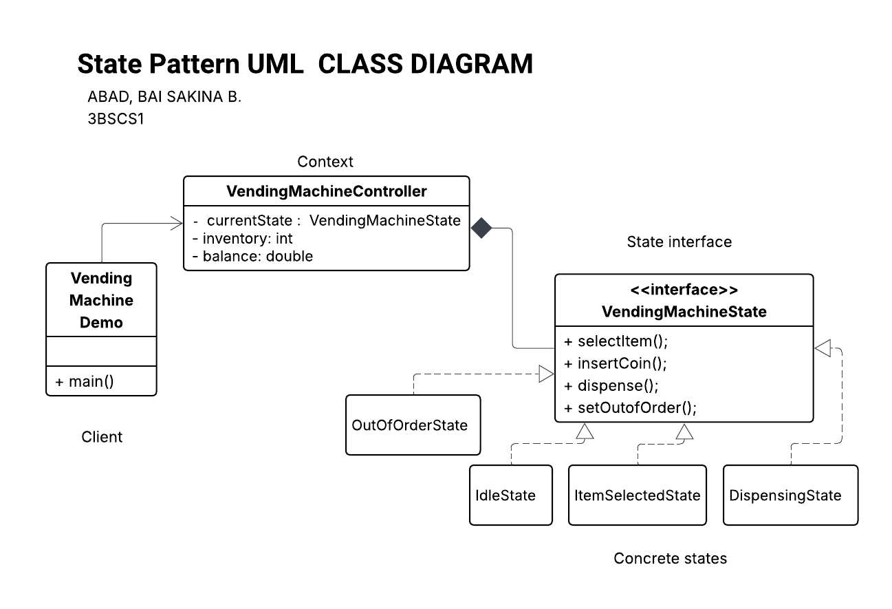

# 3BSCS1-Lab-Assignment-2-State-Design-Pattern
A  laboratory assignment for State Design Pattern

# Vending Machine State Management System

This repository implements the **State Design Pattern** to manage the operational lifecycle of a vending machine. By transitioning from conditional logic to a state-based architecture, the system ensures that machine operations are handled cleanly, reducing errors as state complexity grows.

A vending machine's behavior changes based on its current state. This project captures transitions across four primary states: **Idle**, **ItemSelected**, **Dispensing**, and **OutOfOrder**.

### State Behaviors and Restrictions

| Action | Idle State | ItemSelected State | Dispensing State | OutOfOrder State |
| --- | --- | --- | --- | --- |
| **Select Item** | Allowed | Restricted | Restricted | Restricted |
| **Insert Coin** | Restricted | Allowed | Restricted | Restricted |
| **Dispense Item** | Restricted | Allowed | Restricted | Restricted |
| **Status** | Waiting for user | Waiting for payment | Processing... | Maintenance required |

## Implementation Details
### 1. The State Interface (`VendingMachineState`)

Defines a uniform contract for all possible actions within the machine:

* `selectItem()`
* `insertCoin()`
* `dispenseItem()`
* `setOutOfOrder()`

### 2. Concrete State Classes

* **IdleState**: The default state. Only allows users to pick an item.
* **ItemSelectedState**: The "payment" state. Users can insert coins or trigger the dispensing process.
* **DispensingState**: A locked state where no manual operations are allowed. It automatically transitions back to **Idle** once the process is finished.
* **OutOfOrderState**: A terminal/error state that blocks all interactions until repaired.

### 3. The Context (`VendingMachineController`)

The `VendingMachineController` class maintains the machine's internal data and delegates logic to the current state object.

**Core Attributes:**

* `inventory: Integer` (Tracks remaining stock)
* `balance: Double` (Tracks current credit)
* `currentState: VendingMachineState` (Reference to the current operational state)

---

##  Transitions

* **Idle**  **ItemSelected**: Triggered when a user successfully selects a product.
* **ItemSelected**  **Dispensing**: Triggered after sufficient payment or selection confirmation.
* **Dispensing**  **Idle**: Automatic transition once the product is delivered.
* **Any State**  **OutOfOrder**: Triggered if a system failure is detected or inventory hits zero.

## UML
